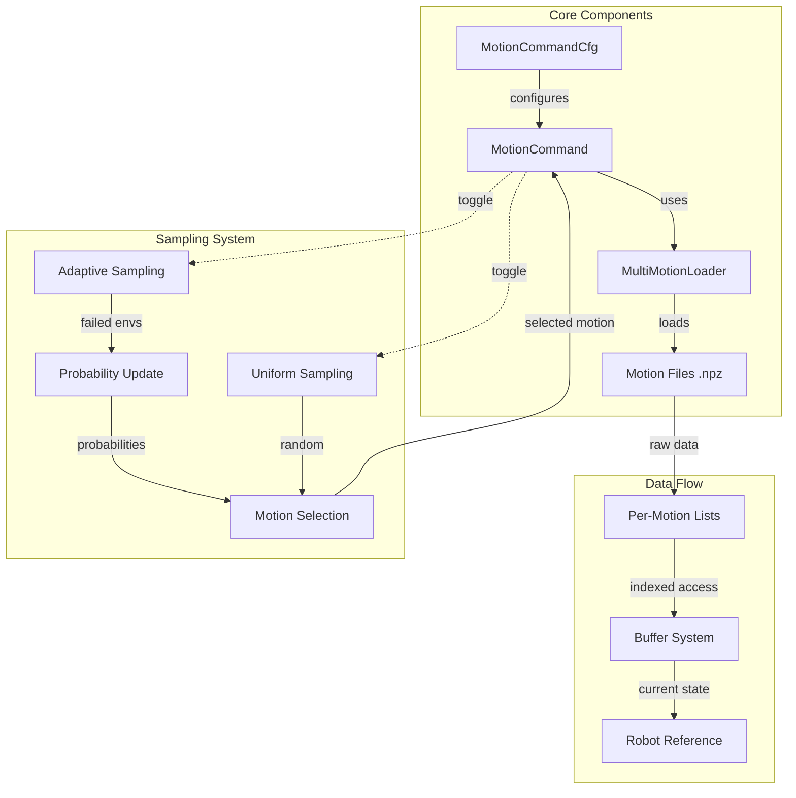
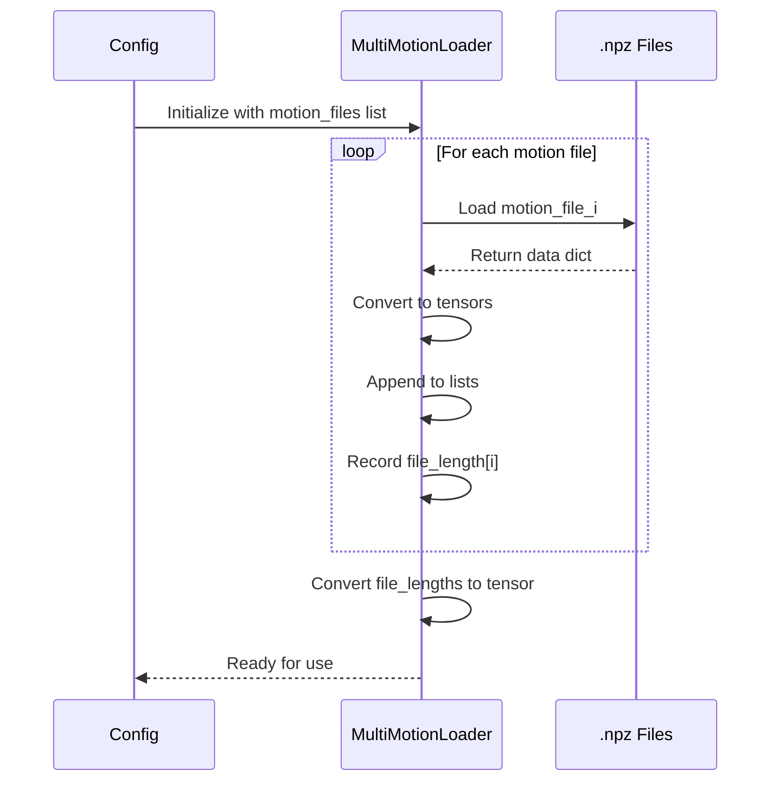
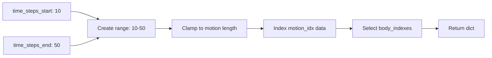
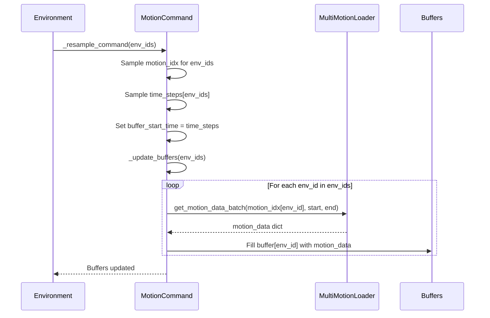
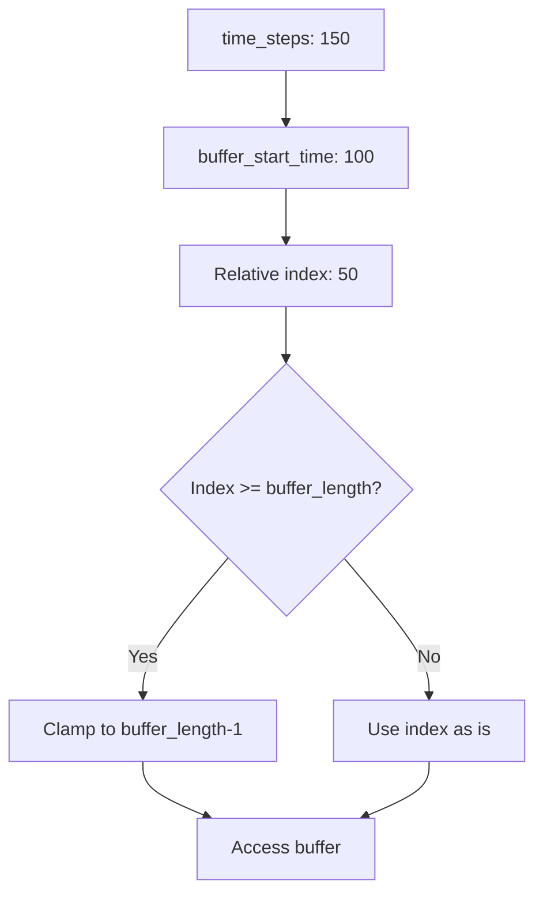
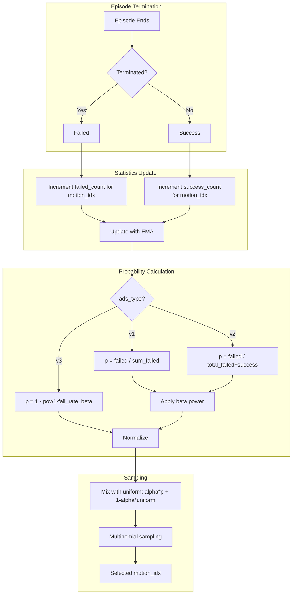
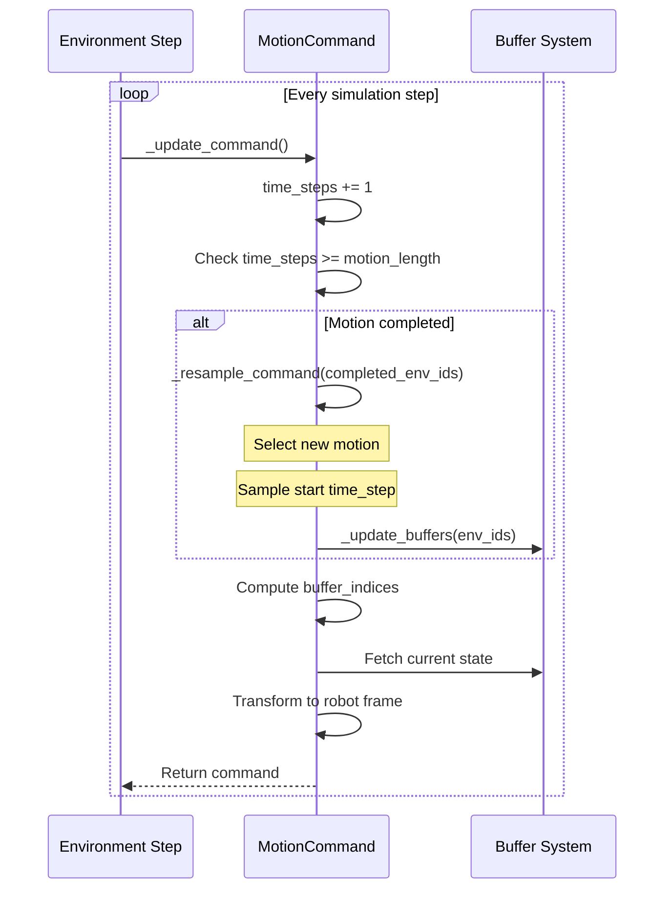
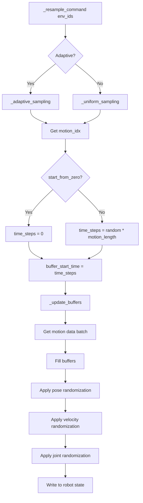
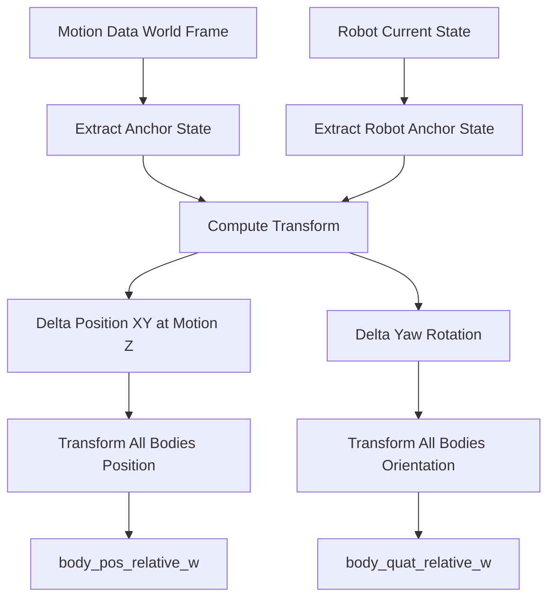
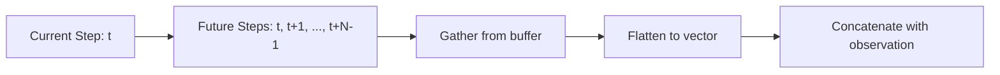

# Multi-Motion Command System Documentation

## Overview

The `commands_multi.py` module implements a sophisticated motion reference system for robot tracking tasks in Isaac Lab. It manages multiple motion files with different framerates and lengths, providing motion commands to robots in parallel environments with adaptive sampling strategies.

## Architecture



## Key Classes

### 1. MultiMotionLoader

The `MultiMotionLoader` class handles loading and managing multiple motion files with different characteristics.

#### Design Philosophy

**Why NOT padding?** The loader stores each motion as a separate list item rather than padding them to a uniform length. This design choice:
- **Avoids memory waste**: No need to pad short motions to match the longest one
- **Preserves original data integrity**: Each motion retains its exact length
- **Enables flexible sampling**: Can handle arbitrary motion lengths dynamically

#### Data Structure

```python
# Each motion stored independently
self.joint_pos_list = []        # List[Tensor[T_i, joint_dim]]
self.joint_vel_list = []        # List[Tensor[T_i, joint_dim]]
self._body_pos_w_list = []      # List[Tensor[T_i, body_dim, 3]]
self._body_quat_w_list = []     # List[Tensor[T_i, body_dim, 4]]
self._body_lin_vel_w_list = []  # List[Tensor[T_i, body_dim, 3]]
self._body_ang_vel_w_list = []  # List[Tensor[T_i, body_dim, 3]]
self.file_lengths = []           # Tensor[num_motions]
```

where `T_i` is the specific length of motion `i`.

#### Loading Process



#### Batch Data Retrieval

The `get_motion_data_batch()` method retrieves a time range from a specific motion:

```python
def get_motion_data_batch(self, motion_idx: int, 
                          time_steps_start: torch.Tensor,
                          time_steps_end: torch.Tensor) -> dict
```

**Key Features:**
- **Clamping**: Ensures time_steps don't exceed motion length
- **Selective indexing**: Only retrieves specified body indices
- **Batch-friendly**: Returns contiguous time slices



### 2. MotionCommand

The main command term that orchestrates motion tracking across parallel environments.

#### Buffer System

The buffer system is crucial for efficient memory access and handling variable-length motions.

**Buffer Design:**
```python
# Buffers shape: [num_envs, buffer_length, ...]
self.joint_pos_buffer       # [N, L, joint_dim]
self.joint_vel_buffer       # [N, L, joint_dim]
self.body_pos_w_buffer      # [N, L, body_dim, 3]
self.body_quat_w_buffer     # [N, L, body_dim, 4]
self.body_lin_vel_w_buffer  # [N, L, body_dim, 3]
self.body_ang_vel_w_buffer  # [N, L, body_dim, 3]
```

**Buffer Length Calculation:**
```python
buffer_length = min(max_episode_length, max(file_lengths)) + future_steps
```

This ensures the buffer can hold:
1. An entire episode worth of data
2. OR the longest motion (if shorter than episode)
3. PLUS future_steps for N-step lookahead

#### Buffer Update Mechanism



#### Data Access with Clamping

When accessing current motion state, the system uses buffer indices with clamping:

```python
buffer_indices = torch.clamp(
    self.time_steps - self.buffer_start_time,
    0, 
    self.buffer_length - 1
)
return self.joint_pos_buffer[env_indices, buffer_indices]
```

**Why clamping?** 
- `time_steps` can exceed `buffer_start_time + buffer_length` if motion is longer than buffer
- Clamping ensures we always get valid data (repeating last frame)
- Prevents out-of-bounds access



## Motion Sampling Strategies

### Uniform Sampling

Simple random selection across all motions:

```python
def _uniform_sampling(self, env_ids: torch.Tensor) -> torch.Tensor:
    return (sample_uniform(0.0, 1.0, (len(env_ids),), device=self.device) 
            * self.motion.num_files).long()
```

### Adaptive Sampling

The adaptive sampling mechanism adjusts motion selection probabilities based on training performance.

#### Core Concept

**Goal**: Sample harder motions more frequently to improve learning efficiency.

**Mechanism**: Track success/failure rates per motion and adjust sampling probabilities.



#### Adaptive Sampling Variants

**Type v1**: Failed-count based
```python
p_fail = failed_motion_count / (failed_motion_count.sum() + 1e-8)
p_fail_sample = pow(p_fail, adaptive_beta)
sampling_prob = p_fail_sample * (1 - uniform_ratio) + uniform_ratio / num_motions
```

**Type v2**: Failed-rate based
```python
p_fail = failed_count / (failed_count + success_count + 1e-8)
p_fail_sample = pow(p_fail, adaptive_beta)
sampling_prob = p_fail_sample * (1 - uniform_ratio) + uniform_ratio / num_motions
```

**Type v3**: Inverse survival rate
```python
p_fail = failed_count / (failed_count + success_count + 1e-8)
p_fail_sample = 1 - pow(1 - p_fail, adaptive_beta)
sampling_prob = p_fail_sample * (1 - uniform_ratio) + uniform_ratio / num_motions
```

#### Exponential Moving Average (EMA)

The system uses EMA to smooth statistics updates:

```python
# After each episode batch
failed_motion_count = alpha * current_failed + (1 - alpha) * failed_motion_count
success_motion_count = alpha * current_success + (1 - alpha) * success_motion_count
```

**Benefits:**
- Prevents drastic probability changes from single episodes
- Incorporates historical performance
- Stable convergence

**With `ads_stable_count=True`:**
```python
# Only update motions that were actually sampled
tried = (current_failed + current_success > 0.5)
failed_count = torch.where(tried, 
                           alpha * current_failed + (1-alpha) * failed_count,
                           failed_count)
```

This prevents untried motions from decaying their counts.

#### Length Weighting (ads_type=v1 only)

When `adaptive_length_weighted=True`:
```python
p_fail = p_fail * motion.file_lengths
p_fail = p_fail / (p_fail.sum() + 1e-8)
```

**Rationale**: Longer motions provide more training signal, so they should be sampled proportionally more.

## Time Stepping and Resampling

### Main Update Loop



### Resampling Flow



### Start Position Sampling

Two modes controlled by `start_from_zero_step`:

1. **From zero** (`start_from_zero_step=True`):
   ```python
   time_steps[env_ids] = 0
   ```
   Always start from the beginning of the motion.

2. **Random start** (`start_from_zero_step=False`):
   ```python
   time_steps[env_ids] = (random[0,1] * motion_length[env_ids]).long()
   ```
   Start from a random point in the motion.

## Handling Different Framerates

### Current Implementation

Currently, all motions are expected to have the same FPS:
```python
self.fps = self.fps_list[0]  # Uses first motion's FPS
```

### Time Step Advancement

The system advances by **integer time steps**, not real time:
```python
# Each simulation step
self.time_steps += 1
```

This means:
- If motion FPS = simulation FPS: Perfect alignment
- If motion FPS ≠ simulation FPS: Time scaling occurs

**Example:**
- Motion recorded at 30 FPS
- Simulation running at 60 FPS
- Each motion frame plays for 2 simulation steps

### Potential Enhancement

To handle different framerates properly:

```python
# Convert to real time
dt_sim = 1.0 / sim_fps
self.time_elapsed += dt_sim

# Convert to motion frames
motion_fps = self.fps_list[motion_idx]
time_steps = (time_elapsed * motion_fps).long()
```

This would require storing time_elapsed per environment and querying FPS per motion.

## Coordinate Frame Transformations

### World Frame vs Robot Frame

The system transforms motion references from world frame to robot-relative frame:



### Transformation Code

```python
# Align XY position but keep motion's Z height
delta_pos_w = robot_anchor_pos_w_repeat
delta_pos_w[..., 2] = anchor_pos_w_repeat[..., 2]

# Only yaw rotation alignment
delta_ori_w = yaw_quat(
    quat_mul(robot_anchor_quat_w_repeat, 
             quat_inv(anchor_quat_w_repeat))
)

# Apply transformation
body_quat_relative_w = quat_mul(delta_ori_w, body_quat_w)
body_pos_relative_w = delta_pos_w + quat_apply(
    delta_ori_w, 
    body_pos_w - anchor_pos_w_repeat
)
```

**Key Points:**
- **XY Position**: Robot's current XY position
- **Z Position**: Motion's reference Z height
- **Yaw**: Robot's current yaw orientation
- **Pitch/Roll**: Motion's reference orientation

This creates a "follow-me" behavior where the motion adapts to the robot's current location and heading.

## Future N-Step Lookahead

### Purpose

Provide the policy with future motion references to enable predictive control.

### Implementation

```python
if cfg.future_steps <= 1:
    return self.joint_pos  # Single step
else:
    # Get indices for next N steps
    current_indices = torch.clamp(
        self.time_steps - self.buffer_start_time, 
        0, buffer_length - 1
    )
    future_indices = current_indices[:, None] + torch.arange(
        cfg.future_steps, device=device
    )[None, :]
    future_indices = torch.clamp(future_indices, 0, buffer_length - 1)
    
    # Gather and flatten
    return buffer[env_indices[:, None], future_indices].view(num_envs, -1)
```

**Output shape**: `[num_envs, future_steps * feature_dim]`



## Random Initialization

### Pose Randomization

When resampling, random offsets are applied:

```python
range_list = [pose_range.get(key, (0.0, 0.0)) 
              for key in ["x", "y", "z", "roll", "pitch", "yaw"]]
ranges = torch.tensor(range_list, device=device)
rand_samples = sample_uniform(ranges[:, 0], ranges[:, 1], 
                              (len(env_ids), 6), device=device)

# Apply position offset
root_pos[env_ids] += rand_samples[:, 0:3]

# Apply orientation offset
orientations_delta = quat_from_euler_xyz(
    rand_samples[:, 3], rand_samples[:, 4], rand_samples[:, 5]
)
root_ori[env_ids] = quat_mul(orientations_delta, root_ori[env_ids])
```

### Velocity Randomization

```python
range_list = [velocity_range.get(key, (0.0, 0.0)) 
              for key in ["x", "y", "z", "roll", "pitch", "yaw"]]
rand_samples = sample_uniform(ranges[:, 0], ranges[:, 1], 
                              (len(env_ids), 6), device=device)
root_lin_vel[env_ids] += rand_samples[:, :3]
root_ang_vel[env_ids] += rand_samples[:, 3:]
```

### Joint Randomization

```python
joint_pos += sample_uniform(*joint_position_range, joint_pos.shape, device)
joint_pos[env_ids] = torch.clip(joint_pos[env_ids],
                                 soft_joint_pos_limits[:, :, 0],
                                 soft_joint_pos_limits[:, :, 1])
```

**Purpose**: Improve policy robustness by training on diverse initial conditions.

## Special Features

### Random Static Motions

When `random_static_prob > 0`, some environments are made static:

```python
# Translate all bodies so anchor stays at frame 0 position
anchor_first = body_pos_w_buffer[env_ids, 0:1, anchor_idx, :]
anchor_current = body_pos_w_buffer[env_ids, :, anchor_idx, :]
translation = anchor_first - anchor_current
body_pos_w_buffer[env_ids] += translation[:, :, None, :]

# Remove anchor velocity component from all bodies
anchor_vel = body_lin_vel_w_buffer[env_ids, :, anchor_idx, :]
body_lin_vel_w_buffer[env_ids] -= anchor_vel[:, :, None, :]
```

**Effect**: Creates a stationary "pose sequence" where the robot doesn't translate, useful for training static skills.

### Motion End Reset

When `motion_end_reset=True`:
```python
self.motion_end_reset_env_idx = self.time_steps >= self.motion_length
```

This flag can be used by termination managers to reset environments when motions complete, rather than looping.

### Freeze Motion

When `freeze_motion=True`:
```python
if not self.cfg.freeze_motion:
    self.time_steps += 1
```

Freezes all motions at their current frame, useful for debugging or testing static tracking.

## Metrics and Monitoring

### Tracking Metrics

```python
metrics["error_anchor_pos"]     # Anchor position error
metrics["error_anchor_rot"]     # Anchor rotation error
metrics["error_anchor_lin_vel"] # Anchor linear velocity error
metrics["error_anchor_ang_vel"] # Anchor angular velocity error
metrics["error_body_pos"]       # Average body position error
metrics["error_body_rot"]       # Average body rotation error
metrics["error_joint_pos"]      # Joint position error
metrics["error_joint_vel"]      # Joint velocity error
```

### Sampling Metrics

```python
metrics["sampling_entropy"]     # Entropy of sampling distribution
metrics["pfail_entropy"]        # Entropy of failure probabilities
metrics["pfail_mean"]           # Mean failure probability
metrics["failed_total_count"]   # Total failed episodes (EMA)
metrics["success_total_count"]  # Total successful episodes (EMA)
metrics["pfail_total"]          # Overall failure rate
metrics["sampling_top1_prob"]   # Probability of most-sampled motion
```

**Entropy Calculation:**
```python
H = -(probabilities * (probabilities + 1e-12).log()).sum()
H_normalized = H / math.log(num_motions)
```

High entropy (→1.0) = uniform sampling  
Low entropy (→0.0) = concentrated on few motions

## Configuration Reference

### MotionCommandCfg

| Parameter | Type | Description |
|-----------|------|-------------|
| `motion_files` | `list[str]` | List of .npz motion file paths |
| `asset_name` | `str` | Name of robot asset in scene |
| `anchor_body_name` | `str` | Name of anchor body (e.g., "pelvis") |
| `body_names` | `list[str]` | List of body names to track |
| `future_steps` | `int` | Number of future steps for lookahead (default: 1) |
| `start_from_zero_step` | `bool` | Always start motions from frame 0 (default: False) |
| `enable_adaptive_sampling` | `bool` | Use adaptive sampling (default: False) |
| `ads_type` | `str` | Adaptive sampling type: "v1", "v2", "v3" (default: "v1") |
| `ads_stable_count` | `bool` | Only decay tried motions (default: True) |
| `adaptive_length_weighted` | `bool` | Weight by motion length (default: False) |
| `adaptive_uniform_ratio` | `float` | Uniform mixing ratio (default: 0.1) |
| `adaptive_alpha` | `float` | EMA coefficient (default: 0.001) |
| `adaptive_beta` | `float` | Probability shaping exponent (default: 0.5) |
| `random_static_prob` | `float` | Probability of static motion (default: -1.0) |
| `motion_end_reset` | `bool` | Reset on motion completion (default: False) |
| `freeze_motion` | `bool` | Freeze all motions (default: False) |
| `pose_range` | `dict` | Position/rotation randomization ranges |
| `velocity_range` | `dict` | Velocity randomization ranges |
| `joint_position_range` | `tuple` | Joint position randomization range |

## Usage Example

```python
from omni.isaac.lab.managers import CommandTermCfg
from commands_multi import MotionCommandCfg

motion_command_cfg = MotionCommandCfg(
    asset_name="robot",
    anchor_body_name="pelvis",
    body_names=["pelvis", "left_foot", "right_foot", ...],
    motion_files=[
        "data/walk_001.npz",
        "data/walk_002.npz",
        "data/run_001.npz",
        # ... more motions
    ],
    future_steps=4,
    enable_adaptive_sampling=True,
    ads_type="v2",
    adaptive_alpha=0.01,
    adaptive_beta=0.5,
    adaptive_uniform_ratio=0.1,
    pose_range={
        "x": (-0.5, 0.5),
        "y": (-0.5, 0.5),
        "yaw": (-3.14, 3.14),
    },
    velocity_range={
        "x": (-0.2, 0.2),
        "y": (-0.2, 0.2),
    },
)
```

## Summary

The multi-motion command system provides:

1. **Flexible Motion Management**: Handle arbitrary numbers of motions with different lengths
2. **Efficient Memory Usage**: No padding, list-based storage per motion
3. **Adaptive Curriculum**: Automatically focus on harder motions
4. **Robust Initialization**: Random pose/velocity/joint offsets
5. **Predictive Control**: N-step lookahead references
6. **Frame Transformation**: Automatic world-to-robot coordinate conversion
7. **Comprehensive Monitoring**: Detailed metrics for training analysis

This architecture enables efficient multi-motion imitation learning across large-scale parallel robot simulation environments.
